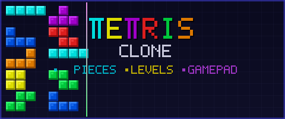

<div align="center">
  

  [](https://www.typescriptlang.org/)
  [](https://vitejs.dev/)
  [](https://vitest.dev/)
  [](LICENSE)

  **🧩 All 7 tetrominoes, authentic BPS scoring, and gamepad support — rebuilt from scratch in TypeScript 🎮**

</div>

---

## 🎯 What makes this different

Most canvas Tetris clones stop at the basics. This one goes further:

| Feature | Details |
|---|---|
| 🎨 All 7 tetrominoes | I, J, L, O, S, T, Z in their classic colors |
| 📈 Authentic scoring | Original BPS system — 40 / 100 / 300 / 1,200 pts |
| 🏆 High score | Persisted locally with `localStorage` |
| ⏩ Progressive speed | 50ms faster per level, 10 lines = level up |
| 🎮 Gamepad support | Full controller input alongside keyboard |
| 🧪 Unit tested | Vitest with canvas mock for all core logic |

## 🚀 Quick Start

```bash
npm install
npm run dev
```

Open `http://localhost:5173` and start playing.

## 🕹️ Controls

| Key | Action |
|---|---|
| `←` `→` | Move piece left / right |
| `↓` | Soft drop |
| `↑` | Rotate piece |
| `P` | Pause / Resume |
| `R` | Restart |

Gamepad is also fully supported — connect a controller and play immediately.

## 🧪 Tests

```bash
npm test
```

Core logic is covered — collision detection, board creation, piece generation, fall speed, and row removal.

## 🏗️ Build

```bash
npm run build    # Outputs to /dist
npm run preview  # Preview the production build locally
```

## 🛠️ Tech Stack

- **TypeScript** — typed game logic
- **HTML Canvas API** — dual-canvas rendering (board + next piece)
- **Vite** — dev server and bundler
- **Vitest** + `vitest-canvas-mock` — unit testing with canvas support
